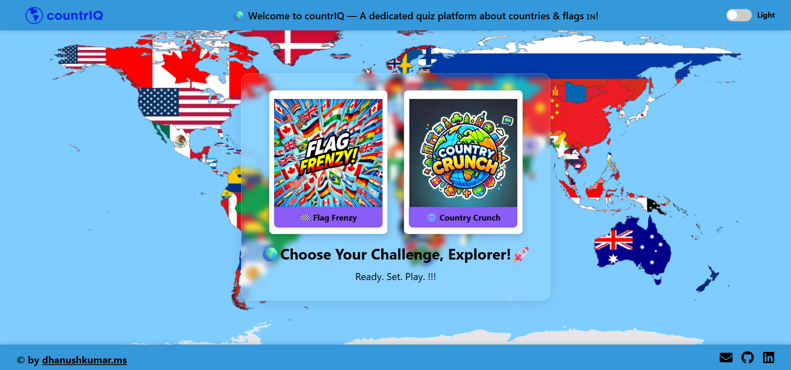
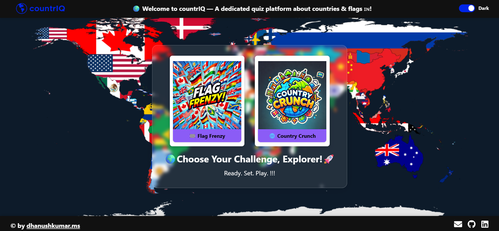
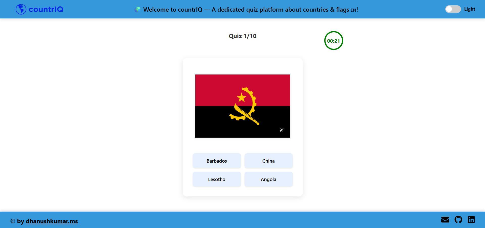
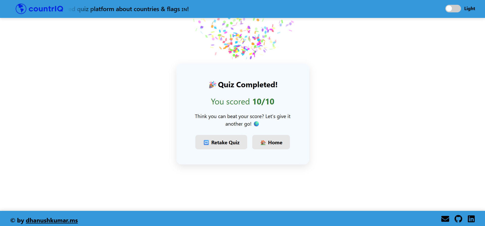
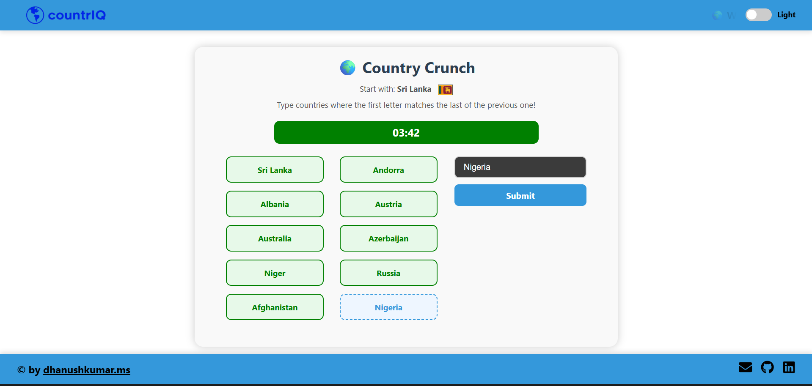
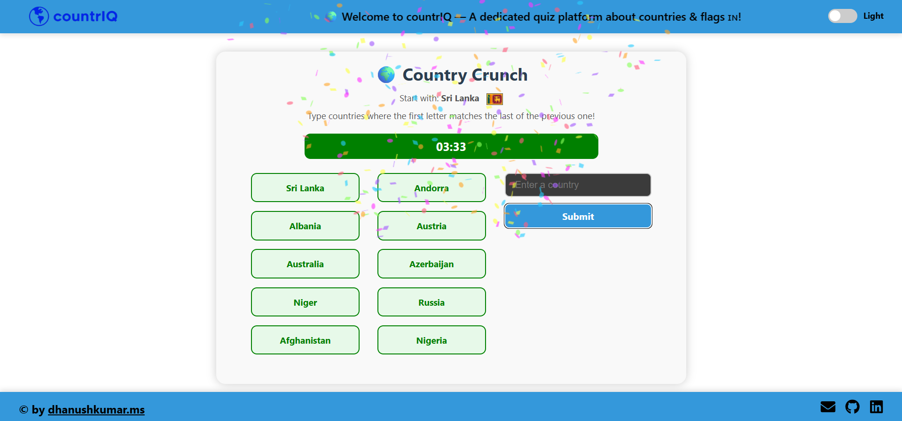

# 🌍 countriQ - The Ultimate Country Quiz Platform!

Welcome to **countriQ**, an engaging, interactive quiz platform designed to test your knowledge of countries and their flags! Whether you're a geography enthusiast or just looking for a fun challenge, CountriQ offers two exciting game modes to keep you hooked.
---

  

---

## 🚀 Live Demo

---

## 🛠️ Tech Stack

  
  
  
  
  
  
  

---

## 🎮 Features

- 🎌 **Flag Frenzy!**  
  Guess the country name by looking at its flag — but hurry, you only have **30 seconds** for each question!  
  A fast-paced, flag-identification challenge to sharpen your global awareness.

- 🌐 **Country Crunch!**  
  It's a battle of wits with our chatbot!  
  Name a country that starts with the **last letter** of the previous country's name.  
  No time limit — just pure strategic fun!

- ✅ Two unique quiz experiences in one platform  
- ✅ Flag database for hundreds of countries  
- ✅ Interactive chatbot for text-based gameplay  
- ✅ Clean, mobile-friendly design  
- ✅ Smooth navigation and feedback messages  
- ✅ Built with scalability in mind  

---

## 📸 Screenshots

|  |  |  |
|---------------------------------------------|---------------------------------------------|-----------------------------------------------|
|  |  |  |

---

## 🚀 Deployment

The project is deployed using [Netlify](https://www.netlify.com) for easy, fast, and reliable hosting.  

---

## 📜 License

This project is licensed under the **MIT License**. See the [LICENSE](./LICENSE) file for details.

---

## 👨‍💻 Author

**Dhanushkumar M**

---

## 🌍 Play. Learn. Master the World with CountriQ!

